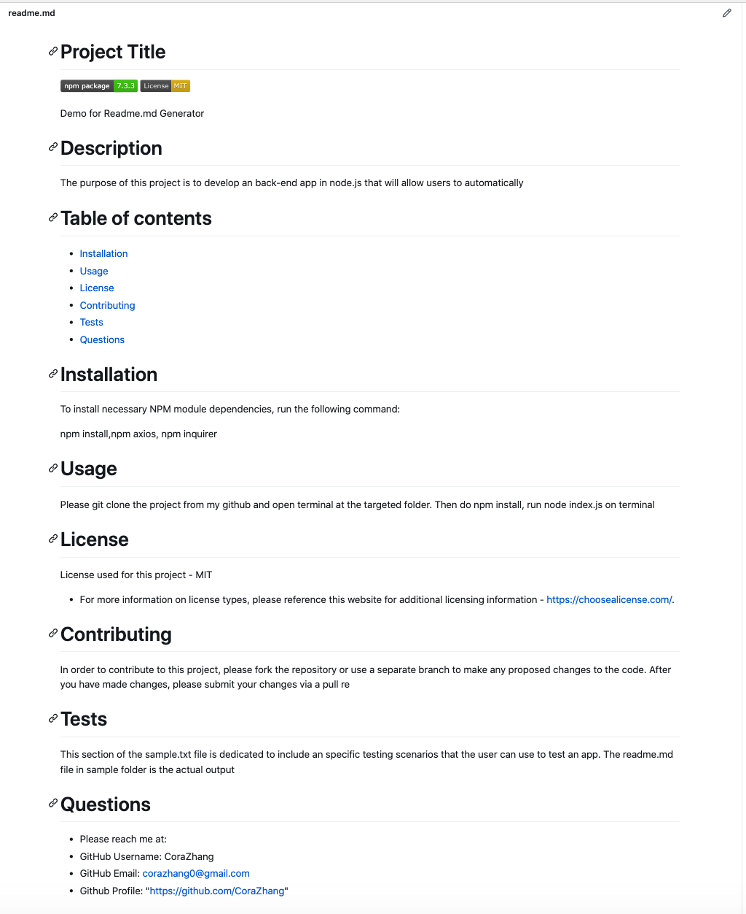
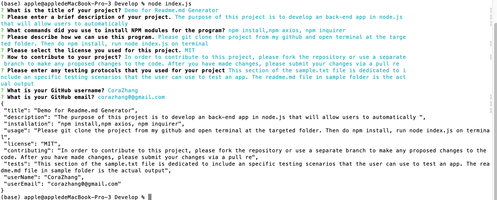

# Node.js and ES6+ Project: Good README Generator

When creating an open source project on GitHub, it is important to have a quality README with information about the app--what is the app for, how to use the app, how to install it, how to report issues, and how to make contributions so that other developers are more likely to use and contribute to the success of the project. A command-line application will allow for quick and easy generation of a project README to get started quickly. This will allow a project creator to spend more time working on finishing the project and less time creating a good README.

The task is to create a command-line application that dynamically generates a professional README.md from a user's input using the [Inquirer package](https://www.npmjs.com/package/inquirer). Review the [Good README guide](../../01-HTML-Git-CSS/04-Important/Good-README-Guide/README.md) as a reminder of everything that a quality, professional README contains. The application will be invoked with the following command:

```
node index.js
```

## What is done
* Created command-line application that accepts user input
* The project title user entered will be displayed as title of generated readme.md
* Description, table of contents, installation, usage, license choice, contribution, tests and questions will be displayed after the user answering all questions
* The information will be added to the sections entitled Description, Installation, Usage, Contributing, and Tests
* The badge of choosen license will be added to the top of the readme file and a notice is added to the entitled License, explaining which license the application is covered
* The Github user name, email address will be added to section entitled Questions, with link to the github profile and instructions to reach me
* When clicking on the links in the table of contents, user will be taken to the corresponding section of readme

## User Story

```
AS A developer
I WANT a README generator
SO THAT can quickly create a professional README for a new project
```

## Acceptance Criteria

```md
GIVEN a command-line application that accepts user input
WHEN I am prompted for information about my application repository
THEN a quality, professional README.md is generated with the title of your project and sections entitled Description, Table of Contents, Installation, Usage, License, Contributing, Tests, and Questions
WHEN I enter my project title
THEN this is displayed as the title of the README
WHEN I enter a description, installation instructions, usage information, contribution guidelines, and test instructions
THEN this information is added to the sections of the README entitled Description, Installation, Usage, Contributing, and Tests
WHEN I choose a license for my application from a list of options
THEN a badge for that license is added hear the top of the README and a notice is added to the section of the README entitled License that explains which license the application is covered under
WHEN I enter my GitHub username
THEN this is added to the section of the README entitled Questions, with a link to my GitHub profile
WHEN I enter my email address
THEN this is added to the section of the README entitled Questions, with instructions on how to reach me with additional questions
WHEN I click on the links in the Table of Contents
THEN I am taken to the corresponding section of the README
```

## Minimum Application Requirements

* Functional application.

* The generated README includes the following sections: 

  * Title
  * Description
  * Table of Contents
  * Installation
  * Usage
  * License
  * Contributing
  * Tests
  * Questions

* The generated README includes 1 badge that's specific to the repository.


## Additional Requirements

* Create a `.gitignore` file and include `node_modules/` and `.DS_Store/`.

* `node_modules` is not tracked and uploaded to GitHub. 

* Repo **MUST** include `package.json` with required dependencies. (Hint: Run `npm init` when you first setup the project before installing any dependencies.)

## Test

* The sample-text.txt in sample folder is one of the testing scenarios. You can change the answers to generate different readme.md files

## Demo

* A walkthrough video demonstrating the functionality of the application. --The video recording is stored in DemoRecordings folder
* Link: https://www.dropbox.com/s/jy59tcrgzyg7ofe/DemoRecording.mov?dl=0

* A sample README.md file for a project repository generated using your application. -- The generated readme.md file is stored in sample folder


* Screen shot of terminal : 



